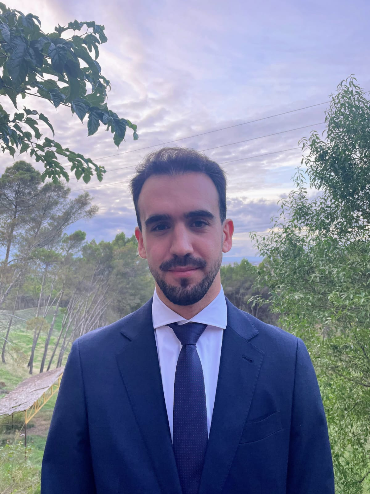

<link rel="stylesheet" href="https://cdnjs.cloudflare.com/ajax/libs/font-awesome/6.0.0-beta3/css/all.min.css">
<link rel="stylesheet" href="assets/css/styles.css">

<button id="themeToggleButton" onclick="toggleTheme()" style="margin-bottom: 20px; padding: 5px 10px; font-size: 16px;">
  <i class="fas fa-moon"></i>
</button>

  <!-- Barra lateral izquierda -->
  

    
    
    <h2>Ramiro Estrella Pernetti</h2>
    
<strong>IT Systems Technician</strong>

    <h3>Contacto</h3>
    

      
      
    

  

  <!-- Contenido principal -->
  

    <h3>Educación</h3>
    <ul>
      <li>Grado en Ingeniería Telemática, Universidad Abierta de Cataluña (2024 - Actual)</li>
      <li>Grado en Ingeniería Telemática, Universidad Politécnica Alcalá de Henares (2023 - No finalizado)</li>
      <li>Técnico superior en telecomunicaciones y sistemas informáticos, CIFP Ferrolterra (2019 - 2021)</li>
    </ul>

    <h3>Experiencia Laboral</h3>
    <h4>Técnico en operaciones de sistemas informáticos en la DGSYFYP</h4>
    
<em>Septiembre 2023 - Actual</em>

    <ul>
      <li>Monitorización de infraestructura</li>
      <li>Documentación detallada de procedimientos y configuraciones</li>
      <li>Maquetación de equipos</li>
      <li>Gestión de usuarios M365</li>
      <li>Participación en proyecto de migración de M365 junto con servidor Exchange</li>
      <li>Gestión de ticketing mediante software propietario</li>
      <li>Participación en proyectos de implantación del ENS CCN-CERT</li>
    </ul>

    <h4>Técnico de instalación y mantenimiento de telecomunicaciones</h4>
    
<em>Junio 2022 - Septiembre 2022</em>

    <ul>
      <li>Instalación y mantenimiento de equipos de telecomunicaciones</li>
      <li>Gestión de redes estructuradas</li>
      <li>Maquetación de equipos</li>
      <li>Gestión usuarios M365</li>
      <li>Virtualización de equipos con VMWare</li>
      <li>Gestión de ticketing mediante software propietario</li>
    </ul>

    <h3>Certificaciones</h3>
    <ul>
      <li><a href="enlace">Microsoft Certified: Azure Fundamentals</a></li>
      <li><a href="enlace">Microsoft 365 Certified: Fundamentals</a></li>
      <li><a href="enlace">ITIL 4 ® Foundation</a></li>
    </ul>
  

